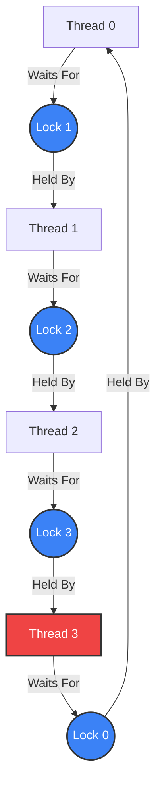

# Deadlock Detection and Recovery Engine 🛡️


A deterministic, multithreaded Virtual Machine written in C++ that bridges the gap between Operating Systems theory and low-level systems programming. 

This project simulates how operating systems can natively manage resource contention. The engine parses concurrent workloads, dynamically hunts for resource deadlocks using graph theory, and guarantees workload completion through a self-healing rollback mechanism.

## ✨ Key Features

* **Config-Driven Virtual Machine:** Dynamically parses and executes multithreaded transaction scripts (`LOCK`, `UNLOCK`, `SLEEP`) from a text file, allowing for rapid testing of complex concurrency traps and race conditions.
* **$O(V+E)$ Cycle Detection:** Utilizes an asynchronous Watchdog Daemon running **Tarjan’s Strongly Connected Components (SCC)** algorithm. It continuously builds Resource Allocation Graphs (RAG) to hunt for dependency cycles in real-time.
* **Smart Reaper Protocol (Thread Aging):** Resolves deadlocks by tracking a `kill_count` (Aging/Priority metric) for each thread. When a cycle is detected, the engine targets the youngest, least-aborted thread to break the cycle, mathematically preventing **Thread Starvation**.
* **Self-Healing Workloads:** When a thread is terminated, its held resources are forcefully rolled back (`std::condition_variable` notifications). The aborted thread is placed in a penalty delay before automatically restarting its workload from Step 0, ensuring no tasks are permanently lost.

## 🏗️ Architecture & Cycle Detection

The engine relies on a strict separation of concerns between the threads doing the work and the daemon monitoring the memory. When a deadlock occurs, the Watchdog maps it out like this:


*In this 4-way deadlock, the Reaper identifies **Thread 3** (highlighted in red) as the youngest thread with the lowest armor, terminates it to break the cycle, and queues it for a self-healing retry.*

## 💻 Quick Start

### 1. Compile the Engine
This project requires a C++ compiler supporting C++20.
```bash
g++ -std=c++20 main.cpp -o DeadlockEngine
```

### 2. Configure the Workload
Define your scripts in `workload.txt`. The engine dynamically scales the number of threads and resources based on this file. 

**Example: The Cascading Ring Trap**
```text
THREAD 0: LOCK 0, SLEEP 200, LOCK 1, UNLOCK 1, UNLOCK 0
THREAD 1: LOCK 1, SLEEP 200, LOCK 2, UNLOCK 2, UNLOCK 1
THREAD 2: LOCK 2, SLEEP 200, LOCK 3, UNLOCK 3, UNLOCK 2
THREAD 3: LOCK 3, SLEEP 200, LOCK 0, UNLOCK 0, UNLOCK 3
```
*Note: The `SLEEP 200` ensures all threads grab their first lock simultaneously, guaranteeing a perfect deadlock.*

### 3. Run the Simulation
```bash
./DeadlockEngine
```

## 🔍 Example Output (Self-Healing in Action)

When the Ring Trap is executed, the Watchdog accurately detects the $0 \rightarrow 1 \rightarrow 2 \rightarrow 3 \rightarrow 0$ cycle. It assassinates the youngest thread (Thread 3) to clear the traffic jam. Thread 3 levels up its priority ("Armor") and successfully restarts once the resources are free.

```text
Loaded config: 4 Threads, 4 Resources.

[Thread 0] Starting workload (Armor: 0)...
[Thread 1] Starting workload (Armor: 0)...
[Thread 2] Starting workload (Armor: 0)...
[Thread 3] Starting workload (Armor: 0)...

========================================
[WATCHDOG] DEADLOCK DETECTED! Threads involved: 3 2 1 0 
[REAPER] Terminating Thread 3 to break cycle.
========================================

>>> [Thread 3] Workload aborted! Retrying in 100ms...
<<< [Thread 1] SUCCESS! Workload fully committed.
<<< [Thread 2] SUCCESS! Workload fully committed.
<<< [Thread 0] SUCCESS! Workload fully committed.
[Thread 3] Starting workload (Armor: 1)...
<<< [Thread 3] SUCCESS! Workload fully committed.
```
